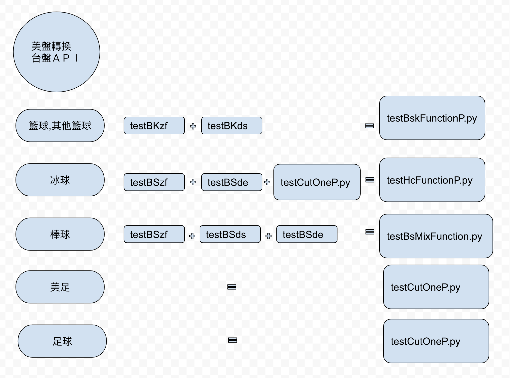

# NewAsia function
美盤轉台盤 API

* 籃球 : testBskFunctionP.py
* 棒球 : testBsMixFunction.py
* 冰球 : testHcFunctionP.py
* 美足 : testCutOneP.py
* 足球 : testCutOneP.py

Mehtod: POST

* 一包資料
API URL: http://txpywapi.nice666.net:5004/transWithProtobuf

## 啟動服務
```
機器 223
cd toTwP
python toTWhandiApi.py & >/dev/null 2>&1
或是 (目前使用↓)
gunicorn -w 3 -k gevent -b 0.0.0.0:5004 toTWhandiApi:app & >/dev/null 2>&1

```
## 內容
```
經Post 傳送protobuf (byte)資料到Api
            ↓
Api (解析 .轉換 .轉成protobuf .傳到MQ)

```

## 程式說明
程式|功能
----|----
[APHDC.proto]|protobuf格式
[APHDC_pb2]|protoc --python_out=. APHDC.proto  產生
[testBSde.py]|專用棒球用獨贏算讓分Func（線上使用）
[testBskFunctionP.py]|籃球執行檔（線上使用）
[testBKds.py]|籃球大小Func（線上使用）
[testBKzf.py]|籃球讓分Func（線上使用）
[testCouOneP.py]|美盤減一（線上使用）
[testHcFunctionP.py]|冰球執行檔（線上使用）
[testBSzf.py]|美棒冰球讓分Func（線上使用）
[testBSds.py]|美棒大小Func（線上使用）
[testBsMixFunctionP.py]|美棒執行檔 (線上使用)
[gun.conf]| gevent 設定檔
[mapping.py]|mapping
[sendMQ.py]|sendMQfunction
[toTWhandiApi.py]|Main Api

- - - - - -


## 流程圖
